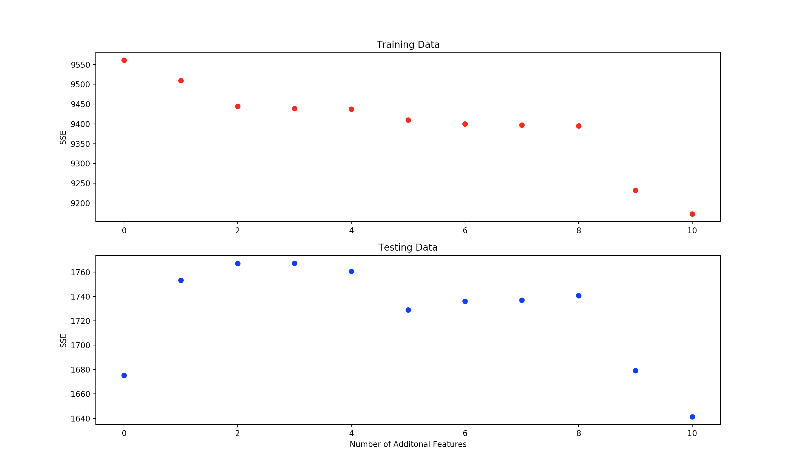
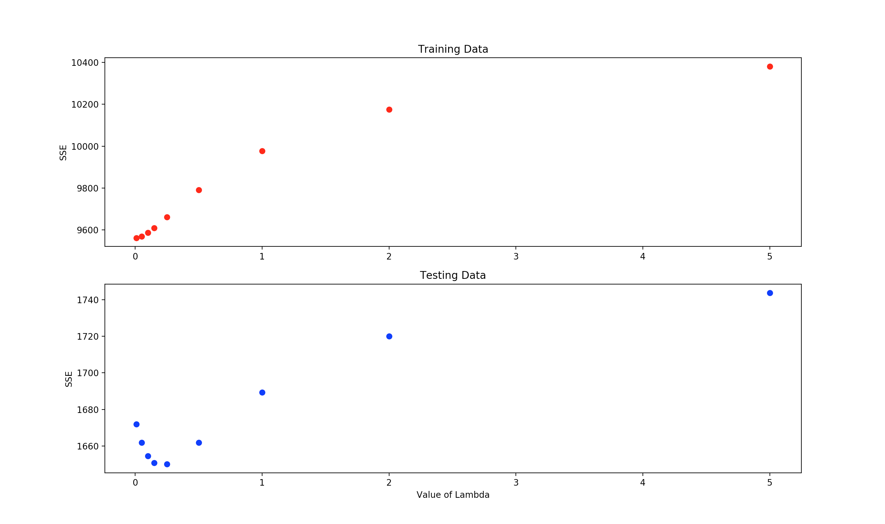

# Simple Linear Regression 

This project is a very simple demonstration  of the application of linear regression 
to real estate data in order to predict real estate value. The method is applied to 
the Carnegie Mellon Boston housing dataset. The data and the infomation about the
features can be found [here]( http://lib.stat.cmu.edu/datasets/boston).

## Usage

This project was built using Python 2.7.14. The only libraries that we need access  
to to run this script are the NumPy library and MatPlotLib. The data is included in 
the repository. This data could be replaced by another dataset with the same number 
of features and run properly. 

### Prerequisites

To run this script you will need Python 2.7 and NumPy
 system or using it for a little demo

## Running, Input, and Output 

### Running

To run this file, get into the 'Linear_Regression' directory and enter

```
Python2.7 HousingPriceRegression.py
```
### Input

The name of the input files are `housing_train.txt` and `housing_test.txt` for the
training and testing data respectivly. These files can be replaced assuming the 
replacement files are formated the same way.

### Output

#### Single Dummy Feature Relationship

The first output to the terminal is a demonstration of the results of adding 
a dummy variable of all ones. The error function we use to determine the accuracy 
of the learing model is sum squared error (SSE).

```
Training Data With Dummy SSE:  9561.19128998
Test Data With Dummy SSE:  1675.23096595
Training Data Without Dummy SSE:  12467.4299083
Test Data Without Dummy SSE:  1589.74933546
```
As we can see, the addition of the dummy variable increases the accuracy of the
training data but actually causes overfitting and therefore decreases the ability
of the model to predict the outcomes of the test set. 

#### Adding Random Features

Now we will demonstrate the result of continuing to add random features to the data.
We will continually add random features to the dataset and graph the number of added
random features against the SSE. 



As we can see from the graph, adding aditional radom features allows the traning process
to overfit the model to the training data resulting in a genearal decrease to in the 
SSE of when applied to the training data. This overfitting, however results in sporatic 
results with an upward trend in SSE when applied to the test set.

#### Adding Hyper Parameter Lambda

To reduce the overfitting problem in the linear regression model we add a hyper parameter 
`lambda`. This punishes the model for adding large weight values. The result is a weight 
vector that is more generalized and therfore does not overfit to the training data as much
as it otherwise might.

<br /> 

To demonstrate this we plot increasing values of lambda with respect to the training and 
testing SSEs.



As we can see, the training data has an increas in SSE as we increase the value of lambda.
This is to be expected as we are preventing the dramatic flexing that the weight vector has 
has a tencancy to take to fit the training data. The testing SSE visably takes a dip before 
rising back up. This bottoming out of the testing SSE shows where the best value of lambda 
is to prevent overfitting to the training data while at the same time providing enought 
flexibility in the weight vector to be an effictive model.

